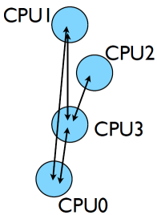
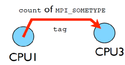

## MPI is a *Library* for Message-Passing

- Not built in to compiler
- Function calls that can be made from any compiler, many languages
- Just link to it
- Wrappers: mpicc, mpif77

**Below program is written in c.**   

```
#include <stdio.h>
#include <mpi.h>

int main(int argc, char **argv) {
    int rank, size;

    MPI_Init(&argc,&argv);
    MPI_Comm_size(MPI_COMM_WORLD, &size);
    MPI_Comm_rank(MPI_COMM_WORLD, &rank);

    printf("Hello, World, from task %d of %d\n",rank,  size);

    MPI_Finalize();
    return 0;
}
```


**Below program is written in fortran.**  

```
program helloworld
    use mpi
    implicit none
    integer :: rank, comsize, ierr

    call MPI_Init(ierr)
    call MPI_Comm_size(MPI_COMM_WORLD, comsize, ierr)
    call MPI_Comm_rank(MPI_COMM_WORLD, rank, ierr)

    print *,'Hello World, from task ', rank, 'of', comsize

    call MPI_Finalize(ierr)
end program helloworld

```
## MPI is a Library for *Message-Passing*
- Communication/coordination between tasks done by sending and  receiving messages.
- Each message involves a function call from each of the programs.
 


 - Three basic sets of functionality: 
   - Pairwise communications via messages
   - Collective operations via messages
   - Efficient routines for getting data from memory into messages and vice versa

## Messages
- Messages have a **sender** and a **receiver**
- When you are sending a message, don't need to specify sender (it's the current processor),
- A sent message has to be actively received by the receiving process



- MPI messages are a string of length __count__ all of some fixed MPI __type__
- MPI types exist for characters, integers, floating point numbers, etc.
- An arbitrary integer __tag__ is also included - helps keep things straight if lots of messages are sent. 
 
## Size of MPI Library   
- Many, many functions (>200)
- Not nearly so many concepts
- We'll get started with just 10-12, use more as needed.

```
MPI_Init()  
MPI_Comm_size()  
MPI_Comm_rank()  
MPI_Ssend()  
MPI_Recv()  
MPI_Finalize()  
```

## Hello World
- The obligatory starting point

**C**   

```
#include <stdio.h>
#include <mpi.h>

int main(int argc, char **argv) {
    int rank, size;

    MPI_Init(&argc,&argv);
    MPI_Comm_size(MPI_COMM_WORLD, &size);
    MPI_Comm_rank(MPI_COMM_WORLD, &rank);

    printf("Hello, World, from task %d of %d\n",rank,  size);

    MPI_Finalize();
    return 0;
}
```


**Fortran**  

```
program helloworld
    use mpi
    implicit none
    integer :: rank, comsize, ierr

    call MPI_Init(ierr)
    call MPI_Comm_size(MPI_COMM_WORLD, comsize, ierr)
    call MPI_Comm_rank(MPI_COMM_WORLD, rank, ierr)

    print *,'Hello World, from task ', rank, 'of', comsize

    call MPI_Finalize(ierr)
end program helloworld

```

> ## Compile and run it
> Pick a language and type in the code. You'll learn more if you don't cut and paste!
> Compile it with `mpicc` or `mpif90` then run the result with `mpirun`. 
>
> > ## Solution
> > ```
> > $ cd mpi/mpi-intro
> > 
> > $ mpif90 hello-world.f90 -o hello-world
> > or 
> > $ mpicc hello-world.c -o hello-world
> > 
> > $ mpirun -np 1 hello-world
> > $ mpirun -np 2 hello-world
> > $ mpirun -np 8 hello-world
> > ```
> {: .solution}
{: .challenge}
