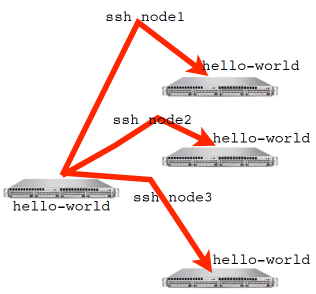

## What mpicc/ mpif90 do

- Just wrappers for the system C, Fortran compilers that have the various -I, -L clauses in there automaticaly
- --showme (an Open MPI option) shows which options are being used, e.g.:

```
$ mpicc --showme hello-world.c -o hello-world

gcc -I/usr/local/openmpi.gcc-1.2.9/include 
  -pthread hello.c -o hello-c 
  -L/usr/local/openmpi.gcc-1.2.9/lib
  -lmpi -lopen-rte -lopen-pal -ldl 
   -Wl,--export-dynamic -lnsl -lutil -lm -ldl
```
- Just runs `gcc hello.world.c -o hello-world` (or whatever the appropriate compiler is - gfortran, icc, pgf90, etc) with a number of options (-I, -L, -l) to make sure right libraries, headers are available.

## What mpirun does
- Launches n processes, assigns each an MPI rank and starts the program
- For multinode run, has a list of nodes, ssh's (or moral equivalent) to each node and launches the program


## Number of Processes
- Number of processes to use is almost always equal to the number of processors
- But not necessarily.
- On your nodes, what happens when you run this?

```
$ mpirun -np 24 hello-world
```
## mpirun runs *any* program
- mpirun will start that process rlaunching procedure for any program
- Sets variables somehow that mpi programs recognize so that they know which process they are

```
$ hostname  
$ mpirun -np 4 hostname  
$ ls
$ mpirun -np 4 ls
```
