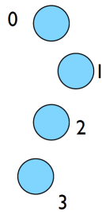
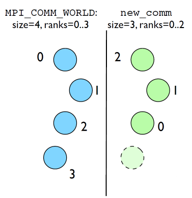

## What the code does
- (FORTRAN version; C is similar)

```
program helloworld
use mpi
implicit none
integer :: rank, comsize, ierr

call MPI_Init(ierr)
call MPI_Comm_size(MPI_COMM_WORLD, comsize, ierr)
call MPI_Comm_rank(MPI_COMM_WORLD, rank, ierr)

print *,'Hello World, from task ', rank, 'of', comsize

call MPI_Finalize(ierr)
end program helloworld

```

- `use mpi` : imports declarations for MPI function calls
- `call MPI_INIT(ierr)`: initialization for MPI library. Must come first. ierr: Returns any error code.
- `call MPI_FINALIZE(ierr)`: close up MPI stuff. Must come last. ierr: Returns any error code.
- `call MPI_COMM_RANK, call MPI_COMM_SIZE`: requires a little more explanation.

## Communicators
- MPI groups processes into communicators.
- Each communicator has some size -- number of tasks.
- Each task has a rank 0..size-1
- Every task in your program belongs to MPI\_COMM\_WORLD

**MPI\_COMM\_WORLD: size=4, ranks=0..3**



- Can create our own communicators over the same tasks
- May break the tasks up into subgroups
- May just re-order them for some reason



- So in this program:

```
program helloworld
use mpi
implicit none
integer :: rank, comsize, ierr

call MPI_Init(ierr)
call MPI_Comm_size(MPI_COMM_WORLD, comsize, ierr)
call MPI_Comm_rank(MPI_COMM_WORLD, rank, ierr)

print *,'Hello World, from task ', rank, 'of', comsize

call MPI_Finalize(ierr)
end program helloworld

```

- we call MPI\_COMM\_RANK, call MPI\_COMM\_SIZE ...
- to get the size of communicator, and this tasks's rank within communicator.
- put answers in rank and size

## Rank and Size much more important in MPI than OpenMP
- In OpenMP, compiler assigns jobs to each thread; don't need to know which one you are.
- MPI: processes determine amongst themselves which piece of puzzle to work on, then communicate with appropriate others.


**Let's look at the same program in c:**

```
#include <stdio.h>
#include <mpi.h>

int main(int argc, char **argv) {
    int rank, size;

    MPI_Init(&argc,&argv);
    MPI_Comm_size(MPI_COMM_WORLD, &size);
    MPI_Comm_rank(MPI_COMM_WORLD, &rank);

    printf("Hello, World, from task %d of %d\n",rank,  size);

    MPI_Finalize();
    return 0;
}
```

- `#include<mpi.h>` vs `use mpi`
- C - functions **return** ierr;
- Fortran - **pass** ierr
- Difference in parameters to MPI_Init

