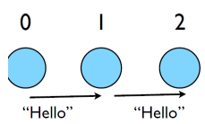

## More complicated example:
-  Let's look at secondmessage.f90, secondmessage.c
-  MPI programs routinely work with thousands of processors.
-  if rank == 0... if rank == 1... if rank == 2...  gets a little tedious around rank=397.
-  More typical programs: calculate the ranks you need to communicate with, and then communicate with them.
-  Let's see how that works.
- **C**:

```
#include <stdio.h>
#include <mpi.h>

int main(int argc, char **argv) {
    int rank, size, ierr;
    int left, right;
    int tag=1;
    double msgsent, msgrcvd;
    MPI_Status rstatus;

    ierr = MPI_Init(&argc, &argv);
    ierr = MPI_Comm_size(MPI_COMM_WORLD, &size);
    ierr = MPI_Comm_rank(MPI_COMM_WORLD, &rank);

    left = rank-1;
    if (left < 0) left = MPI_PROC_NULL;
    right = rank+1;
    if (right == size) right = MPI_PROC_NULL;

    msgsent = rank*rank;
    msgrcvd = -999.;

    ierr = MPI_Ssend(&msgsent, 1, MPI_DOUBLE, right,tag, MPI_COMM_WORLD); 
                     
    ierr = MPI_Recv(&msgrcvd, 1, MPI_DOUBLE, left, tag, MPI_COMM_WORLD, &rstatus);
                     

    printf("%d: Sent %lf and got %lf\n", 
                rank, msgsent, msgrcvd);

    ierr = MPI_Finalize();
    return 0;
}
```
- **Fortran**:

```
program secondmessage
use mpi
implicit none


    integer :: ierr, rank, comsize
    integer :: left, right
    integer :: tag
    integer :: status(MPI_STATUS_SIZE)
    double precision :: msgsent, msgrcvd

    call MPI_INIT(ierr)
    call MPI_COMM_RANK(MPI_COMM_WORLD,rank,ierr)
    call MPI_COMM_SIZE(MPI_COMM_WORLD,comsize,ierr)

    left = rank-1
    if (left < 0) left = MPI_PROC_NULL 
    right = rank+1
    if (right >= comsize) right = MPI_PROC_NULL 

    msgsent = rank*rank
    msgrcvd = -999.
    tag = 1
  
    call MPI_Ssend(msgsent, 1, MPI_DOUBLE_PRECISION, right, &
                   tag, MPI_COMM_WORLD, ierr)
              
    call MPI_Recv(msgrcvd, 1, MPI_DOUBLE_PRECISION, left, & 
                  tag, MPI_COMM_WORLD, status, ierr)
                  
    print *, rank, 'Sent ', msgsent, 'and recvd ', msgrcvd)

    call MPI_FINALIZE(ierr)

end program secondmessage
```
- Calculate left neighbour, right neighbour
- pass rank<sup>2</sup> to right neighbour, receive it from left.
 

## Compile and run

- mpi{cc,f90} -o secondmessage secondmessage.{c,f90}
- mpirun -np 4 ./secondmessage

```
$ mpirun -np 4 ./secondmessage
3: Sent 9.000000 and got 4.000000
0: Sent 0.000000 and got -999.000000
1: Sent 1.000000 and got 0.000000
2: Sent 4.000000 and got 1.000000
```



