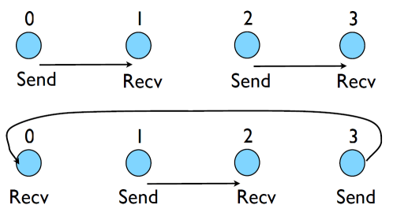
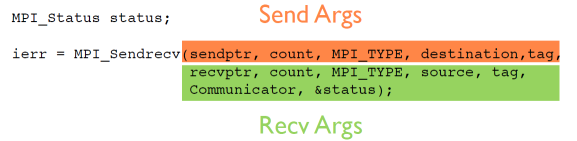
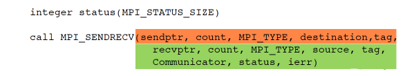

## Different versions of SEND

- SSEND: safe send; doesn't return until receive has started. Blocking, no buffering.
- SEND: Undefined. Blocking, probably buffering
- ISEND : Unblocking, no buffering
- IBSEND: Unblocking, buffering
- Two orthogonal ideas: buffering and blocking.
- The issue in the previous code was **blocking**: Send could not make progress until receive started, but everyone was sending but no one is receiving.

## Buffering is dangerous!
- Worst kind of danger: will usually work.
- Think voice mail; message sent, reader reads when ready
- But voice mail boxes do fill
- Message fails.
- Program fails/hangs mysteriously.
- (Can allocate your own buffers)

# Without using new MPI routines, how can we fix this?
- How about this:
- First: evens send, odds receive
- Then: odds send, evens receive
- Will this work with an odd # of processes?
- How about 2? 1?



```
program fourthmessage
use mpi
implicit none

    integer :: ierr, rank, comsize
    integer :: left, right
    integer :: tag
    integer :: status(MPI_STATUS_SIZE)
    double precision :: msgsent, msgrcvd
    
    call MPI_Init(ierr)
    call MPI_Comm_size(MPI_COMM_WORLD, comsize, ierr)
    call MPI_Comm_rank(MPI_COMM_WORLD, rank, ierr)

    left = rank-1
    if (left <0) left = comsize-1
    right = rank+1
    if (right >=comsize) right = 0

    msgsent= rank*rank
    msgrcvd= -999.
    tag=1

    if (mod(rank,2) == 0) then
        call MPI_Ssend(msgsent, 1, MPI_DOUBLE_PRECISION,right, &
                      tag, MPI_COMM_WORLD,ierr)  
        call MPI_Recv(msgrcvd, 1, MPI_DOUBLE_PRECISION,left, &
                      tag, MPI_COMM_WORLD,status,ierr)
     else 
        call MPI_Recv(msgrcvd, 1, MPI_DOUBLE_PRECISION,left, &
                      tag, MPI_COMM_WORLD,status,ierr)	    
        call MPI_Ssend(msgsent, 1, MPI_DOUBLE_PRECISION,right, &
                      tag, MPI_COMM_WORLD,ierr)
    end if
 
    print *, rank, 'Sent ', msgsent, 'and recvd ', msgrcvd
    call MPI_Finalize(ierr)
end program fourthmessage
```

- In if condition even sends first
- And on else condition odd sends.

**Following is a C program for fourth message**
  
```
#include <stdio.h>
#include <mpi.h>

int main(int argc, char **argv) {
    int rank, size, ierr;
    int left, right;
    int tag=1;
    double msgsent, msgrcvd;
    MPI_Status rstatus;

    ierr = MPI_Init(&argc, &argv);
    ierr = MPI_Comm_size(MPI_COMM_WORLD, &size);
    ierr = MPI_Comm_rank(MPI_COMM_WORLD, &rank);

    left = rank-1;
    if (left < 0) left =size-1;
    right = rank+1;
    if (right == size) right = 0;
    msgsent = rank*rank;
    msgrcvd = -999.;

    if(rank % 2 ==0) {
	ierr = MPI_Ssend(&msgsent, 1, MPI_DOUBLE, right,tag, MPI_COMM_WORLD); 
        ierr = MPI_Recv(&msgrcvd, 1, MPI_DOUBLE, left,tag, MPI_COMM_WORLD, &rstatus); 
	}
    else {
	ierr = MPI_Recv(&msgrcvd, 1, MPI_DOUBLE, left,tag, MPI_COMM_WORLD, &rstatus); 
	ierr = MPI_Ssend(&msgsent, 1, MPI_DOUBLE, right,tag, MPI_COMM_WORLD); 
	}
    printf("%d: Sent %lf and got %lf\n", rank, msgsent, msgrcvd);

    ierr = MPI_Finalize();
    return 0;
}
```

## Something new: Sendrecv
- This sort of logic works, but is quite complicated for such a simple pattern
- Other MPI tools list us do this more easily.
- Sendrecv: A blocking (send and receive) built in together, as opposed to a blocking send followed by a blocking receive.
- Lets them happen simultaneously
- Can automatically pair the sends/recvs!
- Note that this is typical of MPI: with the very basics you can do almost anything, even if you have to jump through some hoops - but there is often more advanced routines which can help do things more clearly, faster.
- dest, source does not have to be same; nor do types or size.  

```
#include <stdio.h>
#include <mpi.h>

int main(int argc, char **argv) {
    int rank, size, ierr;
    int left, right;
    int tag = 1;
    double msgsent, msgrcvd;
    MPI_Status rstatus;

    ierr = MPI_Init(&argc, &argv);
    ierr = MPI_Comm_size(MPI_COMM_WORLD, &size);
    ierr = MPI_Comm_rank(MPI_COMM_WORLD, &rank);

    left = rank-1;
    if (left < 0) left = size-1;
    right = rank+1;
    if (right == size) right = 0;

    msgsent = rank*rank;
    msgrcvd = -999.;

    ierr=MPI_Sendrecv(&msgsent, 1, MPI_DOUBLE, right, tag, &msgrcvd, 1,
                      MPI_DOUBLE, left, tag, MPI_COMM_WORLD, &rstatus );
	
    printf("%d: Sent %lf and got %lf\n", rank, msgsent, msgrcvd);

    ierr = MPI_Finalize();
    return 0;
}
```

**Following is a fortran program for sendrecieve.**

```
program fifthmessage
use mpi
implicit none

    integer :: ierr, rank, comsize
    integer :: left, right
    integer :: tag
    integer :: status(MPI_STATUS_SIZE)
    double precision :: msgsent, msgrcvd
    
    call MPI_Init(ierr)
    call MPI_Comm_size(MPI_COMM_WORLD, comsize, ierr)
    call MPI_Comm_rank(MPI_COMM_WORLD, rank, ierr)

    left = rank-1
    if (left <0) left = comsize-1
    right= rank+1
    if (right >=comsize) right = 0

    msgsent= rank*rank
    msgrcvd= -999.
    tag=1
    
    call MPI_Sendrecv(msgsent, 1, MPI_DOUBLE_PRECISION, right, tag, &
                      msgrcvd, 1, MPI_DOUBLE_PRECISION, left,  tag, &
                      MPI_COMM_WORLD, status, ierr)
 
    print *, rank, 'Sent ', msgsent, 'and recvd ', msgrcvd
    call MPI_Finalize(ierr)
end program fifthmessage
```

## Sendrecv = Send + Recv

**C syntax**



**FORTRAN syntax**


Why are there two different tags/types/counts?

