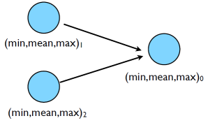
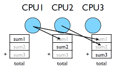
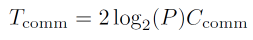
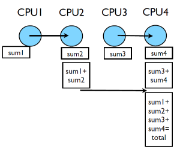
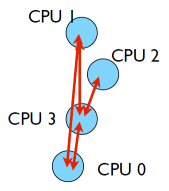

## Min, Mean, Max of numbers

We've just seen one common communications pattern: let's look at another.
Let's try some code that calculates the min/mean/max of a bunch of random numbers -1..1. Should go to -1,0,+1 for large N.

Each process gets a partial result and sends it to some node, say node 0 (why node 0?) 
* ~/mpi/mpi-intro/minmeanmax.{c,f90}
Here's the serial code. How do we parallelize it with MPI?

**Fortran**:

```
program randomdata
implicit none
    integer ,parameter :: nx=1500
    real,allocate :: dat(:)

    integer :: i
    real :: datamin,datamax,datamean
    !  
    ! random data  
    !
    allocate(dat(nx))
    call random_seed(put=[(i,i=1,8])
    call random_number(dat)
    dat=2*dat-1.
    !  
    ! find min/mean/max  
    !
    datamin= minval(dat)
    datamax= maxval(dat)
    datamean= (1.*sum(dat))/nx

    deallocate(dat)

    print *,'min/mean/max =', datamin, datamean, datamax

    return
    end
```

**C**:

```
    /* .... */
    /*  
     * generate random data  
     * /  
    dat=(float *)malloc(nx * sizeof(float));
    srand(0);
    for(i=0;i<nx;i++)
    {
    	dat[i]= 2*((float)rand()/RAND_MAX)-1;
    }

    /*  
     * find min/mean/max 
     */
    datamin = 1e+19;
    datamax = -1e+19;
    datamean = 0;

    for(i=0;i<nx;i++){
    	if (dat[i] < datamin) datamin=dat[i];
    	if (dat[i] > datamax) datamax=dat[i];
    	datamean += dat[i];
    	}
    datamean /= nx;
    free(dat);

    printf("Min/mean/max =%f,%f,%f\n",datamin,datamean,datamax);
```

- Let's try something like this, where everyone calculates their local min, mean, max, then sends everything to rank 0 (say) to combine the results:



> ## Complete the code
> Find the code in ```mpi-tutorial/mpi-intro/minmeanmax-mpi.{c,f90}```
> It's missing a few parameters to MPI_Ssend and MPI_Recv.
> Fill them in, compile it and test it.
> Are the sends and receives adequately paired?
>
> > ## Solutions
> > 
> > Fortran fragment:
> > ```
> >     datamin = minval(dat)
> >     datamax = maxval(dat)
> >     datamean = (1.*sum(dat))/nx
> >     deallocate(dat)  
> > 
> >     if (rank /= 0) then
> >         sendbuffer(1) = datamin
> >         sendbuffer(2) = datamean
> >         sendbuffer(3) = datamax
> >         call MPI_Ssend(sendbuffer, 3, MPI_REAL,0,l ourtag, MPI_COMM_WORLD)  
> >     else
> >         globmin = datamin
> >         globmax = datamax
> >         globmean = datamean
> >             
> >     	do i=2,comsize 
> >             call MPI_Recv(recvbuffer, 3, MPI_REAL, MPI_ANY_SOURCE, &
> >                           ourtag, MPI_COMM_WORLD, status, ierr)
> >             if (recvbuffer(1) < globmin) globmin=recvbuffer(1)
> >             if (recvbuffer(3) > globmax) globmax=recvbuffer(3)
> >             globmean = globmean + recvbuffer(2)
> >         enddo
> > 
> >         globmean = globmean / comsize
> >     endif
> > 
> >     print *,rank, ': min/mean/max = ', datamin, datamean, datamax
> > ```
> > 
> > C fragment:
> > ```
> > 
> >     if (rank != masterproc) {
> >         ierr = MPI_Ssend(minmeanmax,3,MPI_FLOAT,masterproc,tag,MPI_COMM_WORLD);
> >     } 
> >     else {
> >         globminmeanmax[0] = datamin;
> >         globminmeanmax[2] = datamax;
> >         globminmeanmax[1] = datamean;
> >     }   
> >     for (i=1;i<size;i++) {
> >         ierr = MPI_Recv(minmeanmax,,MPI_FLOAT,MPI_ANY_SOURCE,tag,MPI_COMM_WORLD,&rstatus);
> >         globminmeanmax[1] += minmeanmax[1];
> > 
> >         if (minmeanmax[0] < globminmeanmax[0])
> >             globminmeanmax[0] = minmeanmax[0];
> > 
> >         if (minmeanmax[2] > globminmeanmax[2])
> >             globminmeanmax[2] = minmeanmax[2];
> >     }
> >     globminmeanmax[1] /= size;
> >     printf("Min/mean/max = %f,%f,%f\n", globminmeanmax[0],globminmeanmax[1],globminmeanmax[2]);
> > ```
> {: .solution}
{: .challenge}

## But not very efficient!
- Requires (P-1) messages, 2(P-1) if everyone then needs to get the answer.



## Better summing
- Pairs of processors; send partial sums
- Max messages received log2(P)
- Can repeat to send total back




__Reduction; works for a variety of operators(+,*,min,max...)__


```

    print *,rank,': min/mean/max = ', datamin, datamean, datamax
       
    !
    ! Combine data
    !
    call MPI_ALLREDUCE(datamin, globmin, 1, MPI_REAL, MPI_MIN, &
                       MPI_COMM_WORLD, ierr)
    !
    ! If only task 0 needs the result:
    !    call MPI_REDUCE(datamin, globmin, 1, MPI_REAL, MPI_MIN, &
    !                    0, MPI_COMM_WORLD, ierr)
    !
    call MPI_ALLREDUCE(datamax, globmax, 1, MPI_REAL, MPI_MAX, &
                       MPI_COMM_WORLD, ierr)
    call MPI_ALLREDUCE(datamean, globmean, 1, MPI_REAL, MPI_SUM, &
                       MPI_COMM_WORLD, ierr)
    globmean = globmean/comsize
    if (rank == 0) then
        print *, rank,': Global min/mean/max=',globmin,globmean,globmax 
    endif
 
```
- MPI_Reduce and MPI_Allreduce
- Performs a reduction and sends answer to one PE (Reduce) or all PEs (Allreduce)

## __Collective__ Operations



- As opposed to the pairwise messages we've seen
- __All__ processes in the communicator must participate
- Cannot proceed until all have participated
- Don't necessarily know what goes on `under the hood'
- Again, _can_ implement these patterns yourself with Sends/Recvs, but less clear, and probably slower.

> ## Run the AllReduce code
> Find the code in ```mpi-tutorial/mpi-intro/minmeanmax-allreduce.f90```
> Examine it, compile it, test it.
{: challenge}
