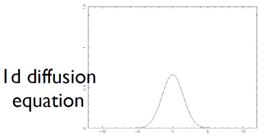
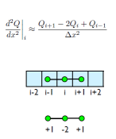
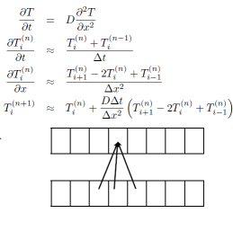
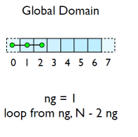
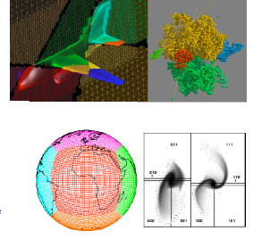
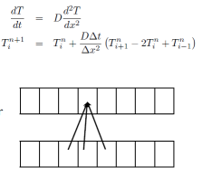
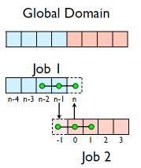

## 1d diffusion equation



```
	cd mpi/diffusion. 
    make diffusionf **or** make diffusionc 
	./diffusionf **or** ./diffusionc
	
```
## Discretizing Derivatives

- Done by finite differencing the discretized values
- Implicitly or explicitly involves interpolating data and taking derivative of the interpolant
- More accuracy - larger `stencils'



## Diffusion Equation
- Simple 1d PDE
- Each timestep, new data for T[i] requires old data for T[i+1], T[i],T[i-1]



## Guardcells
- How to deal with boundaries?
- Because stencil juts out, need information on cells beyond those you are updating
- Pad domain with `guard cells' so that stencil works even for the first point in domain
- Fill guard cells with values such that the required boundary conditions are met



## Domain Decomposition
- A very common approach to parallelizing on distributed memory computers
- Maintain Locality; need local data mostly, this means only surface data needs to be sent
between processes.



## Implement a diffusion equation in MPI

- Need one neighboring number per neighbor per timestep



## Guardcells

- Works for parallel decomposition!
- Job 1 needs info on Job 2s 0th zone, Job 2 needs info on Job 1s last zone
- Pad array with `guardcells' and fill them with the info from the appropriate node by messagepassing or shared memory
 -Hydro code: need guardcells 2 deep



- Do computation
- guardcell exchange: each cell has to do 2 sendrecvs
	- its rightmost cell with neighbors leftmost
	- its leftmost cell with neighbors rightmost
	- Everyone do right-filling first, then left-filling (say)
	- For simplicity, start with periodic BCs
	- then (re-)implement fixed-temperature BCs; temperature in first, last zones are fixed

## Hands-on: MPI diffusion
- cp diffusionf.f90 diffusionfmpi.f90 or
- cp diffusionc.c diffusionc-mpi.c or
- Make an MPI-ed version of diffusion equation
- (Build: make diffusionf-mpi or make diffusionc-mpi)
- Test on 1..8 procs
- add standard MPI calls: init, finalize, comm_size,     comm_rank
- Figure out how many points PE is responsible for (~totpoints/size)
- Figure out neighbors
- Start at 1, but end at totpoints/size
- At end of step, exchange guardcells; use sendrecv
- Get total error

**MPI routines we know so far - C**

```
	MPI_Status status;

	ierr= MPI_Init(&argc,&argv);	
	ierr =MPI_Comm_{size,rank}(communicator, &{size,rank});
	ierr= MPI_Send(sendptr, count,MPI_TYPE, destination,tag,communicator);
	ierr= MPI_Recv(rcvptr,count,MPI_TYPE, source,tag,communicator,&satus);

	ierr=MPI_Sendrecv(sendptr,,count,MPI_TYPE,destination,tag,recvptr,count,MPI_TYPE,source
	,tag,Communicator,&status);

	ierr=MPI_Allreduce(&mydata, &globaldata,count,MPI_TYPE,MPI_OP,Communicator);

	Communicator -> MPI_COMM_WORLD
	MPI_Type ->MPI_FLOAT,MPI_DOUBLE,MPI_INT,MPI_CHAR...
	MPI_OP -> MPI_SUM,MPI_MIN,MPI_MAX,...

```


**MPI routines we know so far - Fortran**


``` 
integer status(MPI_STATUS_SIZE)

call MPI_INIT(ierr)
call MPI_COMM_{SIZE,RANK}(Communicator, {size,rank},ierr)
call MPI_SSEND(sendarr, count, MPI_TYPE, destination,tag, Communicator)
call MPI_RECV(rcvarr, count, MPI_TYPE, destination,tag,Communicator, status, ierr)

call MPI_SENDRECV(sendptr, count, MPI_TYPE, destination,tag,recvptr, count, MPI_TYPE, source,tag,Communicator, status, ierr)
	
call MPI_ALLREDUCE(&mydata, &globaldata, count, MPI_TYPE,MPI_OP, Communicator, ierr)
	
Communicator -> MPI_COMM_WORLD
MPI_Type -> MPI_REAL, MPI_DOUBLE_PRECISION, MPI_INTEGER, MPI_CHARACTER,...
MPI_OP -> MPI_SUM, MPI_MIN, MPI_MAX,...

```
